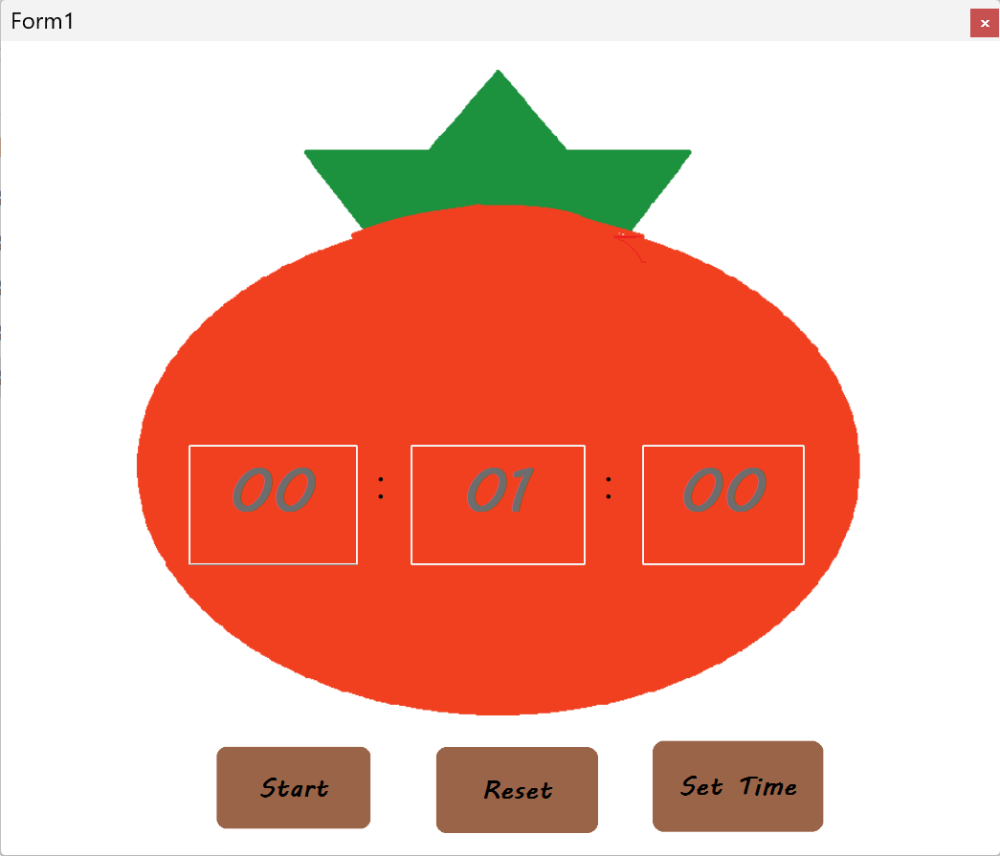
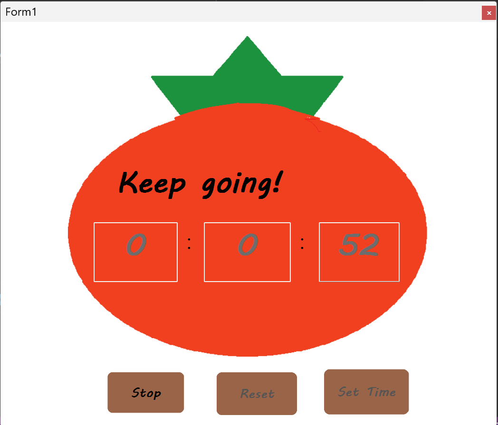
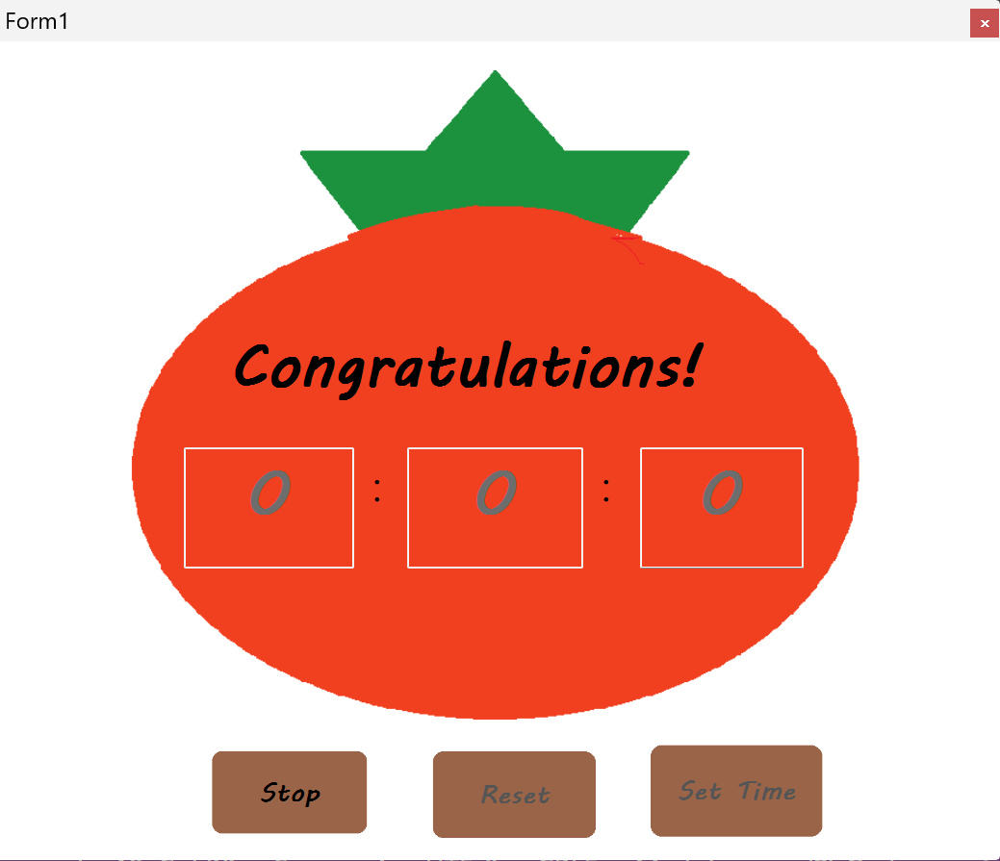

# pomodoro
## About
It's a Project Collaboration exercise using C# and Github.
## Learning Objective
- Understanding C# Windows Form Application.
    - Understanding components such as **label、buttom、timer**.
    - Writing Event handling functions for these conponents.
- Learning Github version control and collaboration.
    - Creating remote repostories.
    - Understanding **add、commit、pull、push、clone** commands.
    - Resolve conflicts
## Showcase
### set time

### start

### running

### Congratulations

